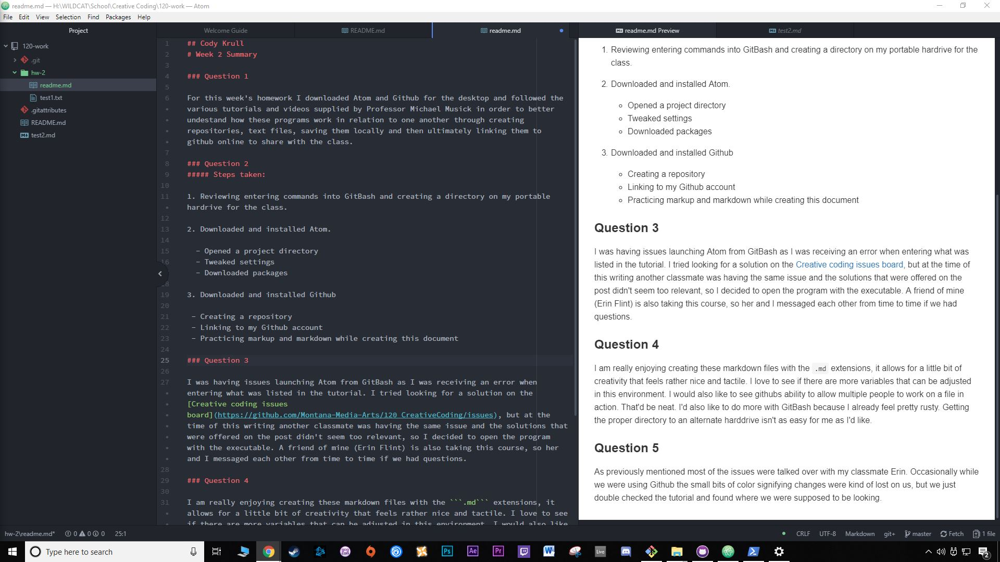

## Cody Krull
# Week 2 Summary

### Question 1

For this week's homework I downloaded Atom and Github for the desktop and followed the various tutorials and videos supplied by Professor Michael Musick in order to better understand how these programs work in relation to one another through creating repositories, text files, saving them locally and then ultimately linking them to Github online to share with the class.

### Question 2
##### Steps taken:

1. Reviewing entering commands into GitBash and creating a directory on my portable hard drive for the class.

2. Downloaded and installed Atom.

  - Opened a project directory
  - Tweaked settings
  - Downloaded packages

3. Downloaded and installed Github

 - Creating a repository
 - Linking to my Github account
 - Practicing markup and markdown while creating this document

### Question 3

I was having issues launching Atom from GitBash as I was receiving an error when entering what was listed in the tutorial. I tried looking for a solution on the [Creative coding issues board](https://github.com/Montana-Media-Arts/120_CreativeCoding/issues), but at the time of this writing another classmate was having the same issue and the solutions that were offered on the post didn't seem too relevant, so I decided to open the program with the executable. A friend of mine (Erin Flint) is also taking this course, so her and I messaged each other from time to time if we had questions.

### Question 4

I am really enjoying creating these markdown files with the ```.md``` extensions, it allows for a little bit of creativity that feels rather nice and tactile. I love to see if there are more variables that can be adjusted in this environment. I would also like to see Githubs ability to allow multiple people to work on a file in action. That'd be neat. I'd also like to do more with GitBash because I already feel pretty rusty. Getting the proper directory to an alternate hard drive isn't as easy for me as I'd like.

### Question 5

As previously mentioned most of the issues were talked over with my classmate Erin. Occasionally while we were using Github the small bits of color signifying changes were kind of lost on us, but we just double checked the tutorial and found where we were supposed to be looking.

### Image of my editor

